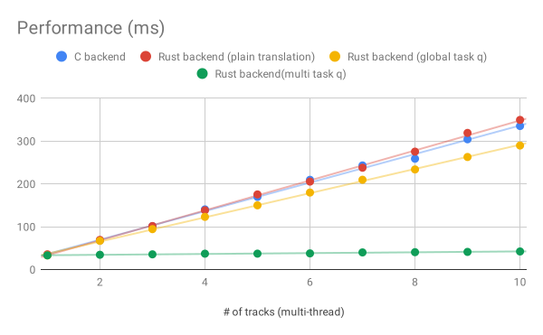

A summary of the *C-to-Rust* oxidizing work for Firefox's audio library on Mac OS.

<!--read more-->

I've been working on *oxidizing* the Firefox's audio backend, named [*Cubeb*][cubeb],
from [*C++*][cubeb-audiounit] to [*Rust*][cubeb-coreaudio-rs] for more than one year.
The new Rust backend has been shipped in *Firefox 74*.

This is the first post for sharing what I’ve worked out.
I am going to summarize the achievements done in this project.
The next [post][shape] is about [how the plan is made][shape].
The final [post][effect] briefs some [tips-and-effects][effect].

## Summary of Cubeb Oxidation on Mac OS

- Solve *10+* data racing issues discovered by enlarging the test coverage
  - Some issues exist for ages but their causes are not easy to be identified
  - They are *6* different causes
- Boost the performance to *35x* faster when starting multiple streams simultaneously
  - A happy side effect when fixing data racing issues
- Hunt and fix *3* memory leaks
- The test coverage of lines is enlarged to almost 80%
  - The left 20% are mostly logs
  - Only *5* bugs are introduced by the new *Rust* backend itself

### Data-racing issues

The data-racing issues could be naturally detected
since all the tests within `cargo test` are run in parallel by default.

The audio library is heavily threaded code.
It is based on various underlying system APIs that may use *mutex* internally
to query or update the device-related settings.
In addition, the library API can be called on the different threads anytime.

In the past, most of the data-racing issues are found
by investigating the bug reported by Firefox users
at the time when the code is already shipped to the wild.
Detecting data-racing issues effectively is a hard topic.
However, `cargo test` framework lowers the barriers.

All the tests within `cargo test` are run in parallel by default,
which means we can spend less effort to write the custom code for running the tests
on the different threads.
The tests will be executed in parallel automatically.
As a result, the obscure problems caused by data-racing emerge more frequently,
even when just running the unit tests.
It can show a surprising fact
that some of the APIs cannot be run at the same time.

### Performance

The performance for starting multiple streams simultaneously is boosted to *35x* faster
after fixing the data-racing issues.

Actually, this achievement is unexpected.
Performance improvement is not included in the goals for this oxidizing project
but it natually happens.
(The goal is simply set to *do-not-cause-performance-regression*.)

The following figure list the performance measurements when starting multiple streams
at the same time on my *MacBook Pro 2017*:

(see all the measurement data [here][measurements])

There are 4 different backends in the test:

1. Blue: The original *C* backend
2. Red: The first workable *Rust* backend rewritten from *C* code on a *line-by-line* basis
    - It rewrites all the lines in a as-same-as-possible way
3. Yellow: The version honors *Rust* style first
    - It rewrites many abnormal *Rust* code translated plainly from *C* code
    - To replace a custom mutex translated from *C* code,
    some APIs are reimplemented with a gloabl task queue or standard *Rust* `Mutex<T>`
4. Green: The version using stream-local task queues instead of a global task queue

There are some fun findings on the above figure.

#### Oxidizing the code from *C* to *Rust* won't improve the performance

There is no much performance differences between *1* and *2*.
If the *Rust* code is implemented in a similar way as what *C* code does,
then their performances are roughly equal.

This is understandable.
The perofrmance won't be soared if the code are run in the same or similar way.

#### But if every line honors the *Rust* rule, the performance is boosted

The figure shows the performance improve a bit when the implementation
goes from *2* to *3*.

If the *Rust* code and the *C* code implement an idea in the same way,
their performances won't get much differences since the machine code generated
from both languages might be similar.

However, when applying the *Rust*'s *stricter-than-C* rules,
the performance may be improved.

*Rust* has strict rules for the *ownership*, *borrowing*,...etc
to force the developers to think their code carefully
and provide well-designed system libraries
that lead developers to write code in a good structure.
In this project, it turns out those strict rules also lead to better performances.

Those limits ends up helping us to find a better way to implement the library APIs.
The code translated from *C* plainly against the *Rust*'s rules
is implemented in another way to make the *Rust* compiler happy.
The story is around removing the custom *mutex* translated from *C*.
At the end, in the version *3*, some APIs replace that custom *mutex*
by *Rust*'s standard `Mutex<T>`; some APIs are re-designed
to use a global task queue instead of using the custom *mutex*
and so the performance is prompted a bit then.

After replacing using custom *mutex* by using a gloabl task queue,
it's clear to see the task queue can become stream-local instead of *gloabl*
so here comes version *4*.
By doing so, some data-racing issues can be avoided at the same time.
Thus, the speed for starting multiple streams simultaneously is much faster.

To be fair, starting multiple streams simultaneously is not really a common case,
so our developers didn't pay too much attention on it before.

But the point needs to be highlighted is:
Even I didn't pay attention on prompting the performance,
it naturally happens! This is amazing!

### Memory leaks

Oxidizing the code into *Rust* gives me a chance to review:
How we manage the memory across API calls?
The new *Rust* APIs would be called in *C++* side.

The memory created and lent outside via one API needs to be
retrieved and destroyed properly in another API
since the memory allocator used in the library
may be different from the call sites.

Pairing the memory allocation and deallocation in the APIs counts on the human eyes
so there is always a chance to miss some spots.

Fortunately, the *LeakSanitizer* can be enabled easily in *Rust Nightly* by
`RUSTFLAGS="-Z sanitizer=leak"` (e.g., `RUSTFLAGS="-Z sanitizer=leak" cargo test`).

Memory leaks can also be hunted by running tests within *Xcode's Instruments*.
It's a very powerful tool that can help identifying where the memory leaks are.
*Xcode's Instruments* would need a *executable* to run tests.
The good news is the *executable* generated by `cargo test`
can be loaded to *Xcode's Instruments* easily.

### Test coverage

The test cases are the founding blocks to build the above achievements.
The data-racing issues can be detected by running tests
on different threads at the same time by simply calling `cargo test`.
Performance can be watched by running benchmark test within `cargo bench`.
Memory leaks and other memory issues can be hunted by running tests with
the [sanitizers][sanitizers] by `RUSTFLAGS="-Z sanitizer=<SAN_NAME>" cargo test`.

As long as the test cases are written properly,
*cargo* frameworks provide enough supports for what developers need.

Enlarging the test-coverage to discover the problems earlier
is one of the goal of the *C-to-Rust* oxidizing project.

The [grcov][grcov] is a convenient tool that help monitoring the test coverage in our code.
It can show the test-coverage status of the *Rust* project [in a few lines][grcov-script].
In this project, the 79.2% lines (in [src/backend][grcov-src-backend]) are covered within the tests.
The left 20.8% code are mostly logs printed when turning on a preference
so most of the product-level code are covered.

For now, only *5* bugs are introduced by the new *Rust* backend itself.
Other problems in the audio library we found can occur in the original *C* backend as well.
By enlarging the test coverage, many bugs are catched before the code is shipped to the wild.

### Conculsion

The experience I learned can be summarized in just one sentence:

**Life is short, use _Rust_!**

### Appendix: Details of the summary

The meta bug is [BMO 1530713](https://bugzilla.mozilla.org/show_bug.cgi?id=1530713).

#### Data racing issues

1. Data race
    - [BMO 1530715](https://phabricator.services.mozilla.com/D29978#inline-182301) - P6: The aggregate device isn’t initialized when it’s set to the current default device
    - [BMO 1530715](https://phabricator.services.mozilla.com/D34054) - P21: BufferFrameSize isn’t set in time
    - [BMO 1594426](https://bugzilla.mozilla.org/show_bug.cgi?id=1594426) - Crash in [@ cubeb_coreaudio::backend::CoreStreamData::close]
    - [BMO 1595457](https://bugzilla.mozilla.org/show_bug.cgi?id=1595457) - Crash in [@ coreaudio_sys_utils::dispatch::create_closure_and_executor::closure_executer]
    - [BMO 1614971](https://bugzilla.mozilla.org/show_bug.cgi?id=1614971)
    - [BMO 1620488](https://bugzilla.mozilla.org/show_bug.cgi?id=1620488)
    - [BMO 1622291](https://bugzilla.mozilla.org/show_bug.cgi?id=1622291)
    - [Bug 1692910](https://bugzilla.mozilla.org/show_bug.cgi?id=1692910) - Crash in [@ cubeb_coreaudio::backend::set_volume]
2. Deadlock
    - [BMO 1572273](https://bugzilla.mozilla.org/show_bug.cgi?id=1572273#c13): Deadlock when unplugging the input device during WebRTC
    - [BMO 1574632](https://bugzilla.mozilla.org/show_bug.cgi?id=1574632): Potential deadlock in cubeb-coreaudio-rs when unplugging the input device during WebRTC
3. Audio I/O issue: No input data for a duplex stream (first output callback comes before first input callback)
    - [BMO 1635973](https://bugzilla.mozilla.org/show_bug.cgi?id=1635973) - Crash in [@ cubeb_resampler_speex<T>::fill_internal_duplex]
        - This appears at least on FF68 (c backend) but stops in FF76 (Rust backend)
    - [BMO 1635982](https://bugzilla.mozilla.org/show_bug.cgi?id=1635982) - Hit `assert(destination && source)` in `PodCopy` when opening a duplex cubeb stream
    - [#79](https://github.com/ChunMinChang/cubeb-coreaudio-rs/pull/79): (Fix a glitch) Always pass all of the buffered input in the resampler
4. Regression data race issues caused by mis-rewriting
    - [BMO 1598413](https://bugzilla.mozilla.org/show_bug.cgi?id=1598413) - Avoid racing issue when play/stop and reinit or destroy stream at the same time
    - [BMO 1614389](https://bugzilla.mozilla.org/show_bug.cgi?id=1614389) - Fix data race found by ThreadSanitizer in cubeb-coreaudio

#### Performance

- [cubeb-coreaudio-rs #28](https://github.com/ChunMinChang/cubeb-coreaudio-rs/issues/28)
- [cubeb-coreaudio-rs #55](https://github.com/ChunMinChang/cubeb-coreaudio-rs/pull/55) ([BMO 1619005](https://bugzilla.mozilla.org/show_bug.cgi?id=1619005) - Rework cubeb-coreaudio threading model)

#### Memory leaks

- [cubeb #495 P1](https://github.com/kinetiknz/cubeb/pull/495/commits/334d98be86c0f8d431852a739e2e4258126ca4f2): Leak memory every time when destroying cubeb context
- [cubeb #495 P2](https://github.com/kinetiknz/cubeb/pull/495/commits/a627a4a1246524f65cb9407a3aa048cfe79a0e15): Leak memory every time when querying device name
- [cubeb-coreaidio-rs #54](https://github.com/ChunMinChang/cubeb-coreaudio-rs/pull/54): Fix memory leak

[cubeb]: https://github.com/kinetiknz/cubeb
[cubeb-audiounit]: https://github.com/kinetiknz/cubeb/blob/master/src/cubeb_audiounit.cpp
[cubeb-coreaudio-rs]: https://github.com/ChunMinChang/cubeb-coreaudio-rs

[measurements]: https://docs.google.com/spreadsheets/d/1rEKN0njYeSxyIqXsw3S2qUJwj5i-DlAA3cBvVKOT5J4/edit?usp=sharing

[sanitizers]: https://github.com/google/sanitizers

[grcov]: https://github.com/mozilla/grcov
[grcov-src-backend]: https://github.com/ChunMinChang/cubeb-coreaudio-rs/tree/2e2266ec4106141d4b0d95fd1b3f77ecef27d00d/src/backend
[grcov-script]: https://github.com/ChunMinChang/cubeb-coreaudio-rs/commit/2e2266ec4106141d4b0d95fd1b3f77ecef27d00d

[shape]: shape-your-code-as-how-you-shape-your-body
[effect]: the-effect-of-practicing-what-you-already-know